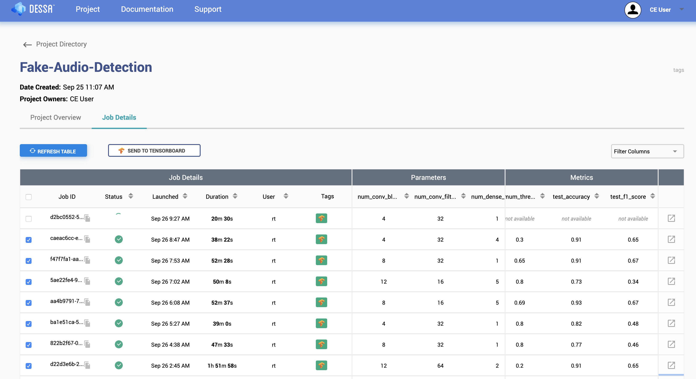
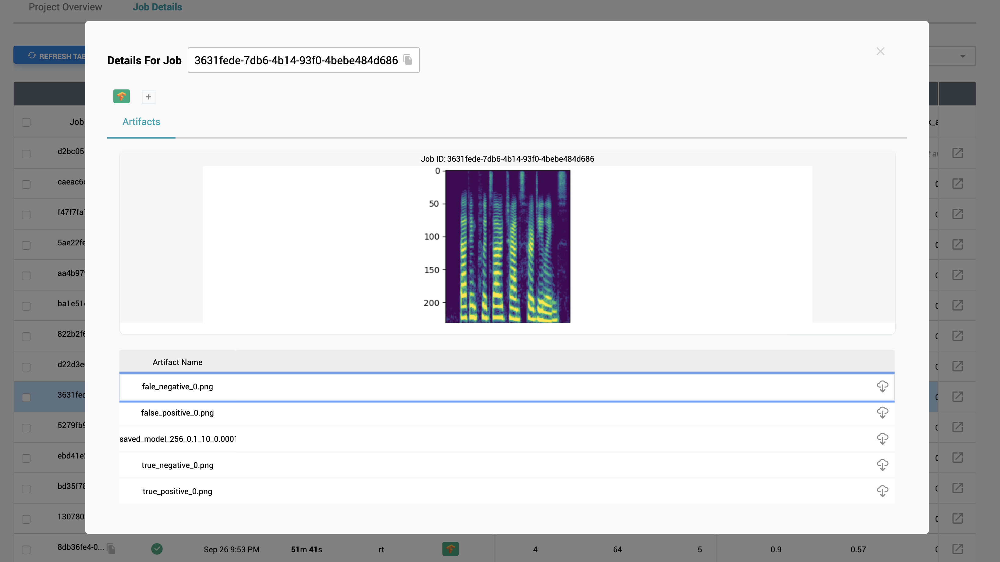
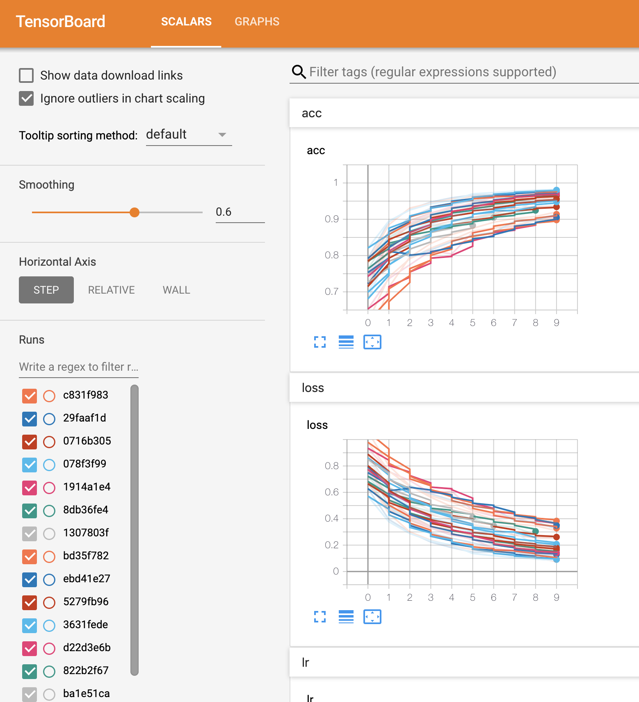

# DeepFake Audio Detection

With the popularity and capabilities of audio deep fakes on the rise, creating defenses against deep fakes used for malicious 
intent is becoming more important than ever. 

We built a fake audio detection model with Foundations Atlas, for anyone to use. 
If you'd like to read more about why we decided to build this, [click here](https://medium.com/@dessa_/detecting-audio-deepfakes-f2edfd8e2b35).

Here are two examples of short audio clips in `./data/example_clips/` folder. One of them is real and the other is fake.

This repository provides the code for a fake audio detection model built using Foundations Atlas. 
It also includes a pre-trained model and inference code, which you can test on any of your own audio files. 

## Setup 
1. Git Clone this repository.
2. If you haven't already, install [Foundations Atlas Community Edition](https://www.atlas.dessa.com/?u=fakeaudio).
3. Once you've installed Foundations Atlas, activate your environment if you haven't already, and navigate to your project folder, and 
then into the `code` directory.
4. Run the following line in the terminal to install the required packages: 

```bash
pip install -r requirements.txt
```

That's it, You're ready to go!

Note: To run the code, your system should meet the following requirements: 
RAM >= 32GB , GPUs >=1

## Overview
The dataset used in this project is from the ASVSpoof 2019 competition. We have used the "logical_access" part of this dataset in this project. The "logical_access" data consist of several short audio clips in `.flac` format. You can download the raw data [here](https://datashare.is.ed.ac.uk/handle/10283/3336). To make it easy for anyone to get started, we provide the already preprocessed audio files (converted to spectrograms) on an Amazon S3 bucket. 

The preprocessed ASV dataset contains train, validation and test set on which the model performance is measured. The model performance is also measured on a state-of-the-art fake voice synthesis model called "Realtalk", created by Dessa. Refer [here](https://medium.com/dessa-news/real-talk-speech-synthesis-5dd0897eef7f) to learn more about RealTalk. 

All of the code required for this project is in the `code/` directory. So, make sure you navigate into the `code/` directory to run any scripts.

To get started, you can download 
this data by running the following command in the terminal (make sure you are running the script from `code/` directory):

```bash
bash download_data.sh
```

Note: Once the download completes, open the `job.config.yml`. 
On line 18, you'll find a the following filepath: `/media/biggie2/sachinrana/fake-audio-detection/data`.
Replace this filepath with the absolute path to the `data/` folder in this project, wherever you've saved it. 

You'll be able to train a model by running `main.py` in your Python Editor, or the following 
line in terminal:

```bash
python main.py
```

This will train a model using our baseline hyperparameters, save it, and evaluate it's performance on a validation and test set. 
You can view the  Atlas GUI (https://localhost:5555) to see the model training, view saved artifacts, or see the model on TensorBoard. 

If you'd like to see our model architecture, or make changes to the model architecture, you can find the model code in `utils.py` in 
the `Discriminator_Model` class. Make changes as you please to see if you can improve the model!

## Using the Pre-trained Model 

We are providing our pre-trained model which is saved on the Amazon S3 bucket. If you ran `bash downlaod_data.sh` then you should see a folder named `fitted_objects/` created inside the `code/` directory inside which you will find the pre-trained model.  This is simple baseline model that we created to get you started. It achieves 85% accuracy and 0.58 f1 score on the test set.

To run our pre-trained model on your own audio:
1. Copy your audio files to `data/inference_data/unlabeled/` 
2. Run the inference script by running `inference.py` in your Python Editor or by running the follow command in the terminal.

```bash
python inference.py
``` 

Once the run completes, you should see a print out with information on predictions of the model, the accuracy of the model on 
your provided data, as well as which examples it got right, and which it got wrong. 


## Running a Hyperparameter Search

Foundations Atlas makes it super easy to run a hyperparameter search. In the `constants.py` file, you can find `generate_config()` function  with the baseline hyperparameters that we searched over. You can replace these with any hyperparemters you want, to use for your model; once 
you're ready, simply run the following command in the terminal to send jobs to Foundations Atlas. 

```bash
python submit_jobs.py
```

Now you should be able to see your running and queued jobs on the Atlas GUI. 


## Foundations Atlas GUI
You can view the  Atlas GUI (https://localhost:5555) to see the model training, view saved artifacts, or see the model on TensorBoard. Here are a few images of the gui:








## License
```
Copyright 2015-2020 Square, Inc.

Licensed under the Apache License, Version 2.0 (the "License");
you may not use this file except in compliance with the License.
You may obtain a copy of the License at

   http://www.apache.org/licenses/LICENSE-2.0

Unless required by applicable law or agreed to in writing, software
distributed under the License is distributed on an "AS IS" BASIS,
WITHOUT WARRANTIES OR CONDITIONS OF ANY KIND, either express or implied.
See the License for the specific language governing permissions and
limitations under the License.
```

© 2020 Square, Inc. ATLAS, DESSA, the Dessa Logo, and others are trademarks of Square, Inc. All third party names and trademarks are properties of their respective owners and are used for identification purposes only.
